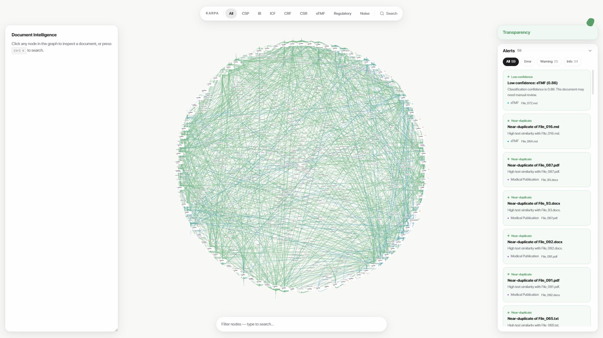
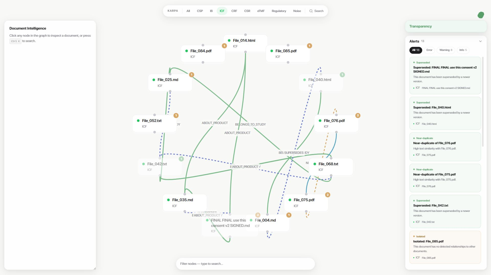
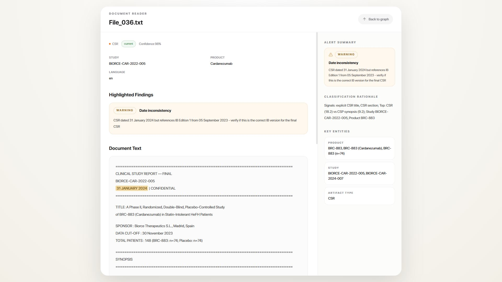

# KARPA

KARPA is an interactive document-intelligence graph for a mixed clinical and regulatory corpus inspired in LLM-Wiki by Andrej Karpathy (that's where KARPA comes from haha). It ingests files, classifies them, extracts relationships, and surfaces alerts such as contradictions, duplicates, outdated versions, and date inconsistencies through a graph-first interface. The repo contains the application and pipeline code.

## Screenshots

### Picture 1

All files are classified inside the graph, with their relationships and detected alerts visible in a single view.

### Picture 2

All files are filtered to the `ICF` class so the graph highlights only those documents and their direct relations.

### Picture 3

This view shows warning detection for a document flagged with a date inconsistency alert.
